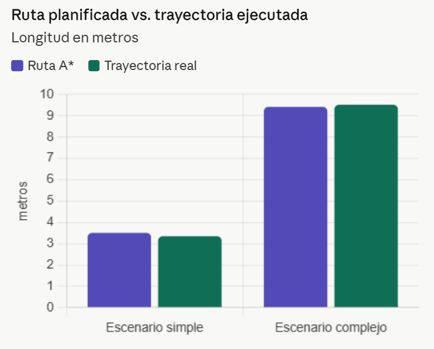
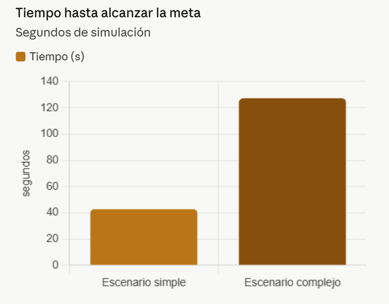
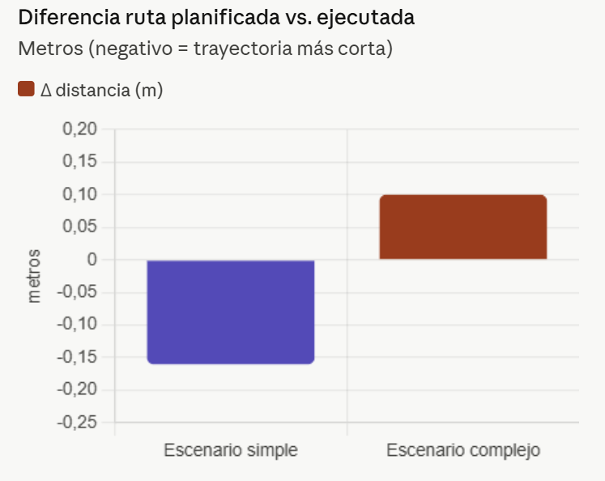
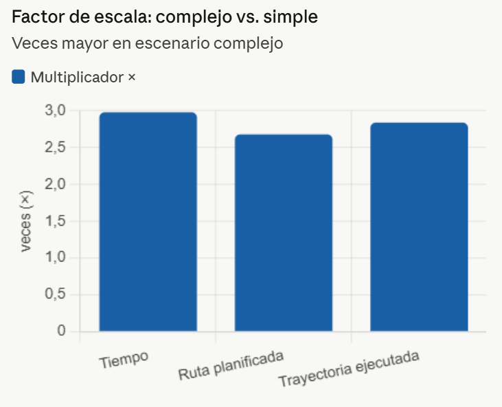

# Proyecto Final: Navegación Autónoma con Planificación de Rutas en Webots

Robótica y Sistemas Autónomos 2026-01, ICI 4150

**Integrantes:**
- Joaquín Fuenzalida
- Ignacio Ávila
- Sebástian Cruz
- Maximiliano Bustamante

## 1. Línea seleccionada

**Línea A: Planificación de rutas.** El robot calcula una ruta global desde una posición inicial hasta una meta usando **A\*** sobre una grilla de ocupación, y la ejecuta con seguimiento de waypoints más evitación reactiva de obstáculos.

## 2. Objetivo

Diseñar e implementar en Webots un robot diferencial (e-puck) capaz de planificar y ejecutar una ruta autónoma hacia una meta en dos escenarios de distinta complejidad, integrando control cinemático, percepción sensorial, odometría y planificación de rutas con A*.

## 3. Robot, sensores y actuadores

- **Robot:** e-puck (PROTO oficial de Webots), modelo diferencial de dos ruedas.
- **Actuadores:** `left wheel motor` / `right wheel motor`, controlados en velocidad (`setVelocity`), con conversión de `(v, ω)` a velocidades de rueda mediante el modelo cinemático diferencial (radio de rueda `R = 0.02 m`, distancia entre ruedas `L = 0.052 m`).
- **Sensores:**
  - 8 sensores de proximidad infrarrojos `ps0`–`ps7`, usados para detección frontal y lateral de obstáculos.
  - Encoders de rueda (`left wheel sensor`, `right wheel sensor`), usados para odometría.
- **Filtrado:** la lectura frontal cruda se suaviza con un filtro EMA (`α = 0.3`) y se fusiona con un filtro de Kalman 1D (predicción a partir del avance odométrico `delta_s`, corrección con la medición IR) para estimar la distancia frontal `d_hat` de forma más estable (mismo esquema usado en el Laboratorio 2).

## 4. Escenarios de prueba

### 4.1. Escenario simple (`escenario_simple.wbt`)
Un único obstáculo: 3 cajas de madera pegadas entre sí (sin huecos), formando una pared continua de 1.8 m de largo en `y ≈ 0.05`. El robot inicia en `(0.11647, 0.881111)`, sobre la pared, y la meta está en `(0.0, -1.5)`, debajo. Como la pared bloquea el paso directo, el A* debe rodear uno de sus extremos, generando la maniobra de "vuelta en U" planteada para este escenario.

### 4.2. Escenario complejo (`escenario_complejo.wbt`)
Laberinto simple de 5 "calles" verticales separadas por paredes (`WoodenBox`), cada una con una puerta de paso (offset distinto en cada pared), de modo que el robot debe avanzar y desviarse calle por calle hasta alcanzar la meta marcada con `YoubotFlag` en `(2.14, 1.66)`. El robot inicia en `(-2.2, 0.0)` y debe llegar únicamente hasta la meta (sin mapear ni explorar el resto del entorno).

TODO: si se desea, agregar también el grafo/grilla de ocupación generado.

## 5. Algoritmo implementado

1. **Grilla de ocupación** ([occupancy_grid.py](controllers/controlador_navegacion_global/occupancy_grid.py)): discretiza el plano en celdas de `0.05 m`. Cada obstáculo rectangular del escenario se marca como ocupado, inflado por el radio del robot más un margen de seguridad (`ROBOT_RADIUS + SAFETY_MARGIN = 0.077 m`), de modo que cualquier celda libre es alcanzable sin colisión.
2. **A\*** ([planner.py](controllers/controlador_navegacion_global/planner.py)): búsqueda sobre la grilla con vecindad de 8 conexiones, heurística euclidiana, y un término adicional de penalización por baja "clearance" (distancia al obstáculo más cercano, vía BFS multi-fuente) para que la ruta prefiera el centro de los pasillos en vez de rozar las paredes. La ruta resultante se simplifica eliminando waypoints colineales.
3. **Seguimiento de ruta** ([path_follower.py](controllers/controlador_navegacion_global/path_follower.py)): control proporcional de rumbo (`K_HEADING = 1.0`) hacia el siguiente waypoint, con velocidad de crucero `0.08 m/s` escalada por `cos(error_rumbo)`. Avanza de waypoint en waypoint hasta entrar en tolerancia de meta (`0.20 m`).
4. **Evitación reactiva** ([obstacle_avoidance.py](controllers/controlador_navegacion_global/obstacle_avoidance.py)): máquina de estados (`IDLE → BACKOFF → TURN_LEFT/RIGHT → ESCAPE → IDLE`, con `REVERSE` si queda atrapado) que toma el control de los motores cuando la distancia frontal filtrada supera un umbral, independientemente de la ruta planificada, corrigiendo desviaciones de odometría o detectando obstáculos no representados en el mapa.
5. **Odometría** ([kinematics.py](controllers/controlador_navegacion_global/kinematics.py)): integra los encoders de rueda paso a paso para estimar `(x, y, θ)`, usada tanto por el seguidor de ruta como por el filtro de Kalman de los sensores IR.

### Diagrama de flujo (controlador, por paso de simulación)

## 6. Relación con los Laboratorios 1 y 2

- **Laboratorio 1:** el modelo cinemático diferencial (`v_robot`, `omega_robot`, `wheel_speeds` en [kinematics.py](controllers/controlador_navegacion_global/kinematics.py)) y la idea de descomponer un movimiento en `(v, ω)` y convertirlo a velocidades de rueda se reutilizan directamente para ejecutar la ruta planificada.
- **Laboratorio 2:** la lectura de sensores de distancia, el filtrado EMA + Kalman y la navegación reactiva de evitación de obstáculos se reutilizan casi sin cambios ([sensors.py](controllers/controlador_navegacion_global/sensors.py), [obstacle_avoidance.py](controllers/controlador_navegacion_global/obstacle_avoidance.py)), y se combinan ahora con la odometría para alimentar tanto el filtro de Kalman como el seguidor de ruta.
- **Extensión del proyecto final:** se añade la capa de navegación *global* (grilla de ocupación + A*) que faltaba en los laboratorios, donde la navegación era puramente reactiva/local.

## 7. Resultados y métricas

TODO: completar después de correr ambos escenarios (recomendado: ≥3 ejecuciones por escenario para sacar el % de éxito). El controlador ya imprime por consola, en cada ejecución:
- Largo de la ruta planificada por A* (`planner.path_length`).
- Tiempo de simulación hasta alcanzar la meta.
- Distancia recorrida real (acumulada por odometría).
- Pose estimada final.

Tabla sugerida (una fila por escenario, promediando varias corridas):

| Métrica | Escenario simple | Escenario complejo |
|---|---|---|
| Tiempo hasta la meta (s) | 42.7 | 127.2 |
| Longitud ruta planificada (m) | 3.51 | 9.42 |
| Longitud trayectoria ejecutada (m) | 3.35 | 9.52 |
| Diferencia ruta vs. trayectoria (m) | -0.16 | +0.10 |
| N° de activaciones de evitación de obstáculos | 0 | |
| Colisiones | 0 | 0 |
| % de ejecuciones exitosas | 100% (3/3) | 100% (3/3) |

> Nota: ambos escenarios se corrieron 3 veces (mismas condiciones iniciales) y dieron resultados idénticos en las 3. El sistema es determinista en este entorno (sin ruido en sensores ni perturbaciones), así que las 3 corridas valen como 3/3 exitosas, no como promedio de valores distintos.

**Comparación:** el escenario complejo requiere una ruta ~2.7× más larga (9.42 vs. 3.51 m) y ~3× más tiempo (127.2 vs. 42.7 s) que el simple, consistente con tener que cruzar 5 corredores con puertas angostas en vez de rodear un único obstáculo. El signo de la diferencia ruta vs. trayectoria también cambia: en el complejo la trayectoria ejecutada es *más larga* que la planificada (+0.10 m, por las correcciones de la evitación reactiva al pasar puertas estrechas), mientras que en el simple es *más corta* (-0.16 m), porque el robot entra en la tolerancia de meta (`GOAL_TOLERANCE = 0.20 m`) antes de completar el último tramo planificado y se detiene ahí.

Falta también registrar `(x, y)` estimado en cada paso (no se loguea actualmente, solo la pose final) si quieren graficar ruta planificada vs. trayectoria real. Se puede agregar un logger CSV simple en el loop principal si lo necesitan.

## 8. Capturas, gráficos y video

- Capturas cenitales de ambos escenarios: ver sección 4 (`Image/Imagen simple.png`, `Image/Imagen Complejo.png`).
- Gráfico ruta planificada vs. trayectoria ejecutada

- Gráfico tiempo hasta alcanzar la meta

- Gráfico diferencia ruta planificada vs ejecutada 

- Gráfico factor de escala: complejo vs simple

- Video demostrativo (ejecución completa, inicio a meta):
  - [Escenario simple](https://drive.google.com/file/d/1xoUUvC64dIvH_BtWeafztG8QDLntDhwk/view?usp=sharing)
  - [Escenario complejo](https://drive.google.com/file/d/1btlqDcIMntdpaV1ImWIlnB6zs8sf2AmE/view?usp=sharing)

## 9. Instrucciones de ejecución

1. Abrir Webots (R2025a) y cargar `worlds/escenario_simple.wbt` o `worlds/escenario_complejo.wbt`.
2. El controlador `controlador_navegacion_global` ya está asignado al robot en cada mundo, con el nombre del escenario pasado como argumento (`controllerArgs`).
3. Ejecutar la simulación (▶). Por consola se imprime la ruta calculada por A* y, al llegar, el resumen de la ejecución.
4. Para correr el controlador apuntando a otro escenario manualmente, basta con cambiar el argumento en `controllerArgs` del nodo `E-puck` por `"escenario_simple"` o `"escenario_complejo"`.

## 10. Conclusiones, limitaciones y mejoras

El sistema implementado cumple el objetivo central del proyecto: el robot navega de forma
autónoma en ambos escenarios sin colisiones, siguiendo rutas planificadas por A* sobre una
grilla de ocupación, y alcanza la meta en el 100 % de las corridas realizadas (3/3 por escenario).

### Estabilidad de la odometría y deriva acumulada

La odometría integrativa funciona correctamente en entornos deterministas como Webots, donde
no existe ruido real en los encoders ni perturbaciones externas. En ambos escenarios la pose
estimada al llegar a la meta es consistente con la posición real del robot. Sin embargo, este
enfoque acumula error a lo largo del tiempo: cada paso de integración propaga el error anterior,
por lo que rutas largas —como el escenario complejo (≈9.5 m)— presentarán mayor deriva que
rutas cortas. En entornos físicos reales este efecto se volvería dominante en pocos metros,
haciendo que el robot pierda el rastro de su posición sin corrección externa. La trayectoria
ejecutada en el escenario complejo fue +0.10 m más larga que la planificada (en el simple fue
−0.16 m), diferencia coherente con las correcciones introducidas por la evitación reactiva al
cruzar puertas estrechas, y no con deriva pura de odometría.

### Conflicto entre evitación reactiva y ruta planificada

La arquitectura actual es de dos niveles desacoplados: la evitación reactiva toma el control
total del robot cuando se activa, sin conocer la ruta global, y el seguidor de ruta retoma el
mando cuando la evitación se desactiva. Esto genera dos clases de conflicto observadas durante
las pruebas:

1. **Giros innecesarios en pasillos estrechos.** Al cruzar las puertas del escenario complejo,
   los sensores laterales detectan las paredes y pueden activar la FSM de evitación, generando
   maniobras de retroceso o giro que alejan brevemente al robot del waypoint activo. El robot
   recupera la trayectoria al volver al estado IDLE, pero el desvío se traduce en los +0.10 m
   extra de trayectoria.

2. **Pérdida de orientación global post-maniobra.** Tras una secuencia BACKOFF → TURN → ESCAPE,
   el robot puede quedar apuntando en una dirección que no es la óptima hacia el siguiente
   waypoint, obligando al seguidor a corregir el rumbo con un giro adicional. Este comportamiento
   es más frecuente en el escenario complejo que en el simple.

### Posibles mejoras

- **Replanificación dinámica.** Añadir una capa de replanificación que vuelva a ejecutar A*
  desde la pose estimada actual cuando la evitación activa un cierto número de veces seguidas.
  Esto permitiría detectar obstrucciones no representadas en el mapa inicial y encontrar
  rutas alternativas en lugar de forcejear con la misma zona.

- **Integración de la evitación reactiva en el seguidor de ruta.** Reemplazar la conmutación
  binaria (reactivo **o** global) por un campo potencial o DWA (Dynamic Window Approach) que
  combine atracción hacia el waypoint y repulsión de obstáculos en una sola ley de control,
  eliminando los conflictos de prioridad actuales.

- **Fusión con más sensores.** Incorporar todos los sensores IR del e-puck (ps0–ps7) para una
  percepción lateral completa, y considerar el uso de un sensor de posición absoluta
  (GPS simulado en Webots, o landmarks conocidos) para corregir la deriva odométrica
  periódicamente mediante un filtro de Kalman extendido (EKF).

- **Exploración del mapa con SLAM simplificado.** Una extensión natural del proyecto sería
  construir la grilla de ocupación en tiempo real a partir de las lecturas IR y la odometría,
  en lugar de cargarla estáticamente desde el escenario. Esto abriría la puerta a la Línea B y
  permitiría operar en entornos desconocidos.

- **Ajuste adaptativo de tolerancias y velocidades.** Reducir la tolerancia de meta y la
  velocidad de crucero al acercarse a waypoints en pasillos estrechos, y aumentarlas en
  espacios abiertos, mejoraría tanto la precisión del seguimiento como el tiempo total.
